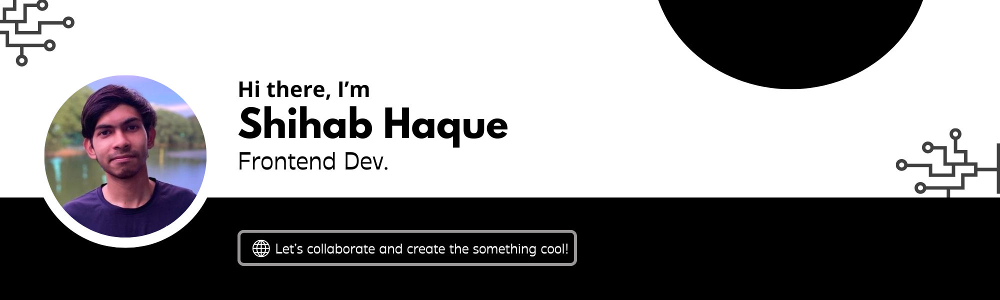

## About Me

#### 
I'm a Frontend developer with a solid understanding in backend. I love to build user-friendly, scalable web applications using modern web technologies and I enjoy turning ideas into functional apps. I am constantly learning and My goal is to contribute to impactful projects that create value and solve complex problems. 

- ✨ I love to learn new things and collaborate with other developers

- 💬 Ask me about anything related to Javascript/Typescript or React/Express

- 🔗 Get to know me more in [my website](https://www.shihabhaque.netlify.app)

- 👨‍💻 I’m currently working on a cool Startup Project!

 

## I code with

 

## Connect with me

 

// ## GitHub Stats

// 

//   
//   
// 

// 

//  
// 

 
